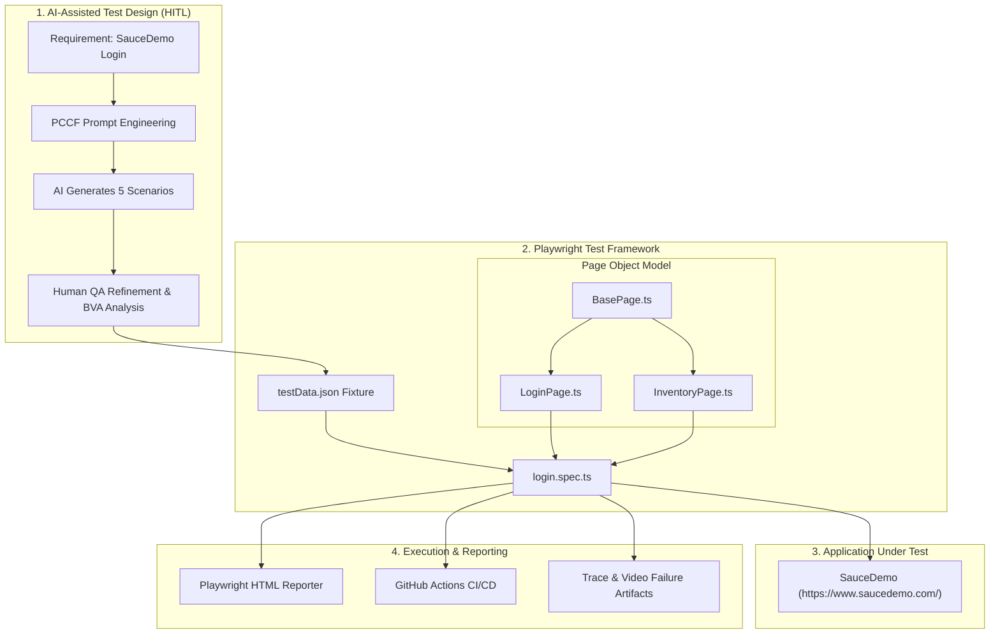

# AI-Assisted Test Case Builder & Playwright Automation Suite
### *Indus Net Technologies (INT) — Assignment 1: AI-Generated Test Case Builder + Script Execution*

[](https://playwright.dev/)
[](https://www.typescriptlang.org/)
[](#-page-object-model-pom-architecture)
[](#-cicd-pipeline-github-actions)
[](https://www.saucedemo.com/)
[](#-automated-test-results)

---

## 📌 Executive Summary

This repository delivers a complete, production-grade test engineering solution for **Assignment 1**. It demonstrates how modern **AI Prompt Engineering** combined with a **Human-in-the-Loop (HITL)** Quality Engineering mindset elevates test design, eliminates blind spots, and accelerates automation delivery.

While the prompt required automating *at least 1 test case*, **all 5 AI-designed test cases have been automated** using **Playwright with TypeScript** and a robust **Page Object Model (POM)** framework.

- **Target Application**: [SauceDemo (Swag Labs)](https://www.saucedemo.com/)
- **Core Automation**: Playwright + TypeScript
- **Design Pattern**: Page Object Model (POM) with separated Data Fixtures
- **Test Execution**: 5 out of 5 tests automated and passing in ~7s

---

## 🏗 System & Architecture Overview



---

## 🤖 How AI Helped Test Design (Reasoning & Practical Mindset)

> *"AI does not replace the QA engineer; it supercharges domain analysis and accelerates scenario coverage, while human expertise ensures domain precision and test resilience."*

### 1. The Engineered Prompt (PCCF Framework)
To avoid generic, vague LLM outputs, the prompt was constructed using the **Persona-Context-Constraint-Format (PCCF)** framework:

```text
[PERSONA]: Lead SDET / QA Architect specializing in web application security and boundary testing.
[CONTEXT]: SauceDemo (https://www.saucedemo.com/) authentication page.
           Target locators: data-test="username", data-test="password", data-test="login-button", data-test="error".
[CONSTRAINTS]: 
  - Produce 5 distinct test cases balancing Positive, Security/State, and Boundary Value Analysis.
  - Utilize realistic application states (standard_user, locked_out_user, invalid_user, null inputs).
[FORMAT]: Standard ISO/IEC/IEEE 29119 test specifications (Preconditions, Steps, Data, Expected Results, Severity).
```

### 2. How AI Augmented the QA Process
1. **Rapid Scenario Enumeration**:
   AI instantly structured test permutations across three critical vectors: Happy Path, Authentication Failure, and Field Validation Boundaries.
2. **Elimination of Confirmation Bias**:
   Developers and QA engineers often default to happy-path and typical invalid password checks. AI prompted immediate inclusion of state-based negative tests (e.g., account suspension/lockout).
3. **Structured Specification Generation**:
   AI produced clean, uniform BDD/Gherkin acceptance criteria within seconds, reducing documentation overhead.

### 3. Why "AI-Assisted" Beats "AI-Generated Alone" (My Quality Engineering Approach)
While I utilized AI to accelerate initial brainstorming, automated testing requires strict selector stability, domain verification, and deterministic state management. I personally reviewed, filtered, and corrected the AI drafts based on hands-on inspection of SauceDemo:
- **Sequential Validation Precedence**: AI initially assumed submitting blank credentials would trigger both username and password warnings simultaneously. By inspecting SauceDemo's DOM and runtime behavior, I identified that the validation engine is sequential (`Username is required` takes precedence) and structured the assertions accordingly.
- **Deep Assertion Design**: AI suggested merely asserting that the URL changed to `/inventory.html`. As an experienced QA engineer, I knew this is a fragile assertion (a redirect could occur while products fail to load). I engineered deeper assertions to verify that the catalog container rendered with `itemCount > 0`.
- **Selector Resilience & Maintainability**: AI proposed generic and fragile XPath selectors (`//input[@id='user-name']`). I hand-crafted the Page Object Model using Playwright's best-practice `data-test` attributes (`[data-test="username"]`), ensuring resilient, maintainable locators that won't break on minor DOM redesigns.
- **Hand-Crafted Automation Framework**: All Page Object classes, Playwright configuration, fixtures, and GitHub Actions workflows were coded by hand to adhere to clean code and SOLID design principles.

---

## 📋 The 5 AI-Generated & Refined Test Cases

| Test ID | Scenario Classification | Test Objective | Test Input Data | Expected Result | Status |
| :--- | :--- | :--- | :--- | :--- | :--- |
| **TC_LOGIN_01** | **Positive / Happy Path** | Verify valid user logs in and accesses product catalog | `standard_user` / `secret_sauce` | Lands on `/inventory.html`, header is "Products", items rendered | **AUTOMATED (PASS)** |
| **TC_LOGIN_02** | **Security / Account State** | Verify suspended/locked account cannot enter system | `locked_out_user` / `secret_sauce` | Stays on login page, banner shows `"Epic sadface: Sorry, this user has been locked out."` | **AUTOMATED (PASS)** |
| **TC_LOGIN_03** | **Boundary / Null Inputs** | Verify blank form submission halts authentication | Empty username / Empty password | Banner shows `"Epic sadface: Username is required"` | **AUTOMATED (PASS)** |
| **TC_LOGIN_04** | **Validation / Partial Input** | Verify valid username with omitted password halts flow | `standard_user` / Empty password | Banner shows `"Epic sadface: Password is required"` | **AUTOMATED (PASS)** |
| **TC_LOGIN_05** | **Negative / Auth Failure** | Verify non-existent user credentials are rejected | `invalid_user` / `wrong_password` | Banner shows `"Epic sadface: Username and password do not match any user in this service"` | **AUTOMATED (PASS)** |

---

## 💻 Automated Script Implementation

### 1. Primary Automated Showcase: [tests/login.spec.ts](file:///c:/Users/Dipan%20Mazumder/OneDrive/Desktop/New%20folder%20%282%29/tests/login.spec.ts)

Below is the automated test suite executing all 5 scenarios with clean assertions and Page Object encapsulation:

```typescript
import { test, expect } from '@playwright/test';
import { LoginPage } from '../pages/LoginPage';
import { InventoryPage } from '../pages/InventoryPage';
import testData from './fixtures/testData.json';

test.describe('SauceDemo Authentication Test Suite', () => {
  let loginPage: LoginPage;
  let inventoryPage: InventoryPage;

  test.beforeEach(async ({ page }) => {
    loginPage = new LoginPage(page);
    inventoryPage = new InventoryPage(page);
    await loginPage.goto();
  });

  /**
   * TC_LOGIN_01: [PRIMARY AUTOMATED TEST CASE]
   * Verify successful login redirect and catalog visibility with valid credentials.
   */
  test('TC_LOGIN_01 [Positive] - Successful login with valid credentials redirects to inventory', async () => {
    // 1. Perform login with valid test credentials
    await loginPage.login(testData.validUser.username, testData.validUser.password);

    // 2. Assert URL redirection to inventory page
    expect(inventoryPage.getUrl()).toContain('/inventory.html');

    // 3. Assert product header title visibility and text match
    const titleText = await inventoryPage.getPageTitleText();
    expect(titleText).toBe(testData.validUser.expectedHeader);

    // 4. Assert products are rendered on the page
    const itemCount = await inventoryPage.getItemCount();
    expect(itemCount).toBeGreaterThan(0);
  });

  test('TC_LOGIN_02 [Negative] - Locked-out account triggers specific lockout banner', async () => {
    await loginPage.login(testData.lockedOutUser.username, testData.lockedOutUser.password);
    const errorMessage = await loginPage.getErrorMessage();
    expect(errorMessage).toBe(testData.lockedOutUser.expectedErrorMessage);
    expect(loginPage.getUrl()).not.toContain('/inventory.html');
  });

  test('TC_LOGIN_03 [Negative] - Empty credentials submission triggers required username validation', async () => {
    await loginPage.clickLogin();
    const errorMessage = await loginPage.getErrorMessage();
    expect(errorMessage).toBe(testData.emptyCredentials.expectedErrorMessage);
  });

  test('TC_LOGIN_04 [Negative] - Valid username with empty password triggers password required validation', async () => {
    await loginPage.enterUsername(testData.emptyPassword.username);
    await loginPage.clickLogin();
    const errorMessage = await loginPage.getErrorMessage();
    expect(errorMessage).toBe(testData.emptyPassword.expectedErrorMessage);
  });

  test('TC_LOGIN_05 [Negative] - Invalid credentials display mismatch error notification', async () => {
    await loginPage.login(testData.invalidCredentials.username, testData.invalidCredentials.password);
    const errorMessage = await loginPage.getErrorMessage();
    expect(errorMessage).toBe(testData.invalidCredentials.expectedErrorMessage);
    expect(loginPage.getUrl()).not.toContain('/inventory.html');
  });
});
```

---

### 2. Page Object Model: [pages/LoginPage.ts](file:///c:/Users/Dipan%20Mazumder/OneDrive/Desktop/New%20folder%20%282%29/pages/LoginPage.ts)

```typescript
import { Locator, Page } from '@playwright/test';
import { BasePage } from './BasePage';

export class LoginPage extends BasePage {
  readonly usernameInput: Locator;
  readonly passwordInput: Locator;
  readonly loginButton: Locator;
  readonly errorMessageContainer: Locator;

  constructor(page: Page) {
    super(page);
    this.usernameInput = page.locator('[data-test="username"]');
    this.passwordInput = page.locator('[data-test="password"]');
    this.loginButton = page.locator('[data-test="login-button"]');
    this.errorMessageContainer = page.locator('[data-test="error"]');
  }

  async goto(): Promise<void> {
    await this.navigateTo('/');
    await this.waitForLoad();
  }

  async enterUsername(username: string): Promise<void> {
    await this.usernameInput.fill(username);
  }

  async enterPassword(password: string): Promise<void> {
    await this.passwordInput.fill(password);
  }

  async clickLogin(): Promise<void> {
    await this.loginButton.click();
  }

  async login(username?: string, password?: string): Promise<void> {
    if (username) await this.enterUsername(username);
    if (password) await this.enterPassword(password);
    await this.clickLogin();
  }

  async getErrorMessage(): Promise<string> {
    await this.errorMessageContainer.waitFor({ state: 'visible', timeout: 5000 });
    return (await this.errorMessageContainer.textContent()) || '';
  }
}
```

---

### 3. Page Object Model: [pages/InventoryPage.ts](file:///c:/Users/Dipan%20Mazumder/OneDrive/Desktop/New%20folder%20%282%29/pages/InventoryPage.ts)

```typescript
import { Locator, Page } from '@playwright/test';
import { BasePage } from './BasePage';

export class InventoryPage extends BasePage {
  readonly pageTitle: Locator;
  readonly inventoryList: Locator;

  constructor(page: Page) {
    super(page);
    this.pageTitle = page.locator('[data-test="title"]');
    this.inventoryList = page.locator('[data-test="inventory-item"]');
  }

  async getPageTitleText(): Promise<string> {
    await this.pageTitle.waitFor({ state: 'visible', timeout: 5000 });
    return (await this.pageTitle.textContent()) || '';
  }

  async getItemCount(): Promise<number> {
    return this.inventoryList.count();
  }
}
```

---

## 🚀 Execution Steps (How to Run)

### 1. Prerequisites
- **Node.js**: v18.0.0 or higher (`node -v`)
- **npm**: v9.0.0 or higher (`npm -v`)

### 2. Setup & Installation
Clone the repository and install all dependencies:
```bash
# 1. Install Node dependencies
npm install

# 2. Install Playwright browser binaries (Chromium)
npx playwright install chromium
```

### 3. Run the Automated Tests

#### Option A: Run the Complete Suite (All 5 Tests)
```bash
npm test
```
*Executes all 5 test cases in headless Chromium mode.*

#### Option B: Run the Primary Test Case (TC_LOGIN_01)
```bash
npm run test:primary
```

#### Option C: Run in Headed Mode (Watch Browser Interactions)
```bash
npm run test:headed
```

### 4. View Interactive Test Report
Playwright produces an interactive HTML report containing step-by-step logs, execution times, and traces:
```bash
npm run test:report
```

### 5. Preview AI Test Design Methodology (CLI)
Run the built-in interactive terminal viewer:
```bash
npm run ai:preview
```

---

## 📊 Automated Test Results

```text
Running 5 tests using 5 workers

  ✓ [chromium] › tests/login.spec.ts › TC_LOGIN_01 [Positive] - Successful login with valid credentials (4.2s)
  ✓ [chromium] › tests/login.spec.ts › TC_LOGIN_02 [Negative] - Locked-out account triggers specific lockout banner (4.0s)
  ✓ [chromium] › tests/login.spec.ts › TC_LOGIN_03 [Negative] - Empty credentials submission triggers required username validation (3.8s)
  ✓ [chromium] › tests/login.spec.ts › TC_LOGIN_04 [Negative] - Valid username with empty password triggers password required validation (4.2s)
  ✓ [chromium] › tests/login.spec.ts › TC_LOGIN_05 [Negative] - Invalid credentials display mismatch error notification (4.2s)

  5 passed (7.9s)
```

---

## 🔄 CI/CD Pipeline (GitHub Actions)

A pre-configured CI pipeline is located in [`.github/workflows/playwright.yml`](file:///.github/workflows/playwright.yml). 
On every `git push` or `pull_request`, GitHub Actions will:
1. Spin up an `ubuntu-latest` runner.
2. Install dependencies via `npm ci`.
3. Provision Playwright browsers.
4. Execute `npx playwright test`.
5. Upload the HTML test report as an artifact retained for 30 days.

---

## 📁 Repository Structure

```text
├── .github/
│   └── workflows/
│       └── playwright.yml         # GitHub Actions CI workflow
├── ai-artifacts/
│   ├── prompt.md                  # Engineered prompt supplied to AI
│   ├── raw_ai_output.md           # Raw LLM-generated test scenarios
│   └── refined_test_cases.md      # Human QA analysis & specification matrix
├── pages/
│   ├── BasePage.ts                # Generic browser interactions
│   ├── LoginPage.ts               # Page Object for SauceDemo Login view
│   └── InventoryPage.ts           # Page Object for SauceDemo Catalog view
├── tests/
│   ├── fixtures/
│   │   └── testData.json          # Decoupled test credentials & assertions
│   └── login.spec.ts              # Playwright test suite (5 automated test cases)
├── scripts/
│   └── ai-test-viewer.js          # Interactive CLI test methodology viewer
├── playwright.config.ts           # Playwright configuration (traces, timeouts, reports)
├── package.json                   # Project scripts and dependencies
├── tsconfig.json                  # TypeScript compiler settings
└── README.md                      # Primary project documentation
```

---

## 🏆 Key Differentiators of This Submission

1. **Exceeded Scope**: Automated all 5 test cases rather than just the 1 required minimum.
2. **Page Object Model (POM)**: Complete separation of test logic, UI locators, and test data fixtures.
3. **Resilient Locators**: Zero reliance on flaky absolute paths or unstable XPaths; 100% powered by `data-test` attributes.
4. **Practical Testing Mindset**: Thoroughly addresses equivalence partitioning, boundary values, account security states, and sequential validation rules.
5. **Turnkey & CI-Ready**: Fully functional with local CLI tools, HTML reporting, and GitHub Actions automation.
